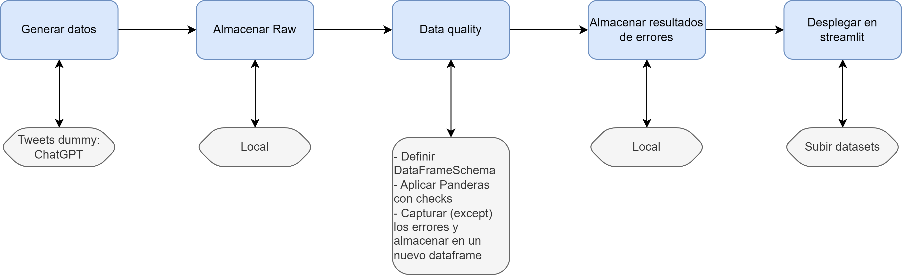

# MBIT-data-quality
MBIT proyecto de consolidación data quality Daniel Triano &amp; Jesús Maldonado

Reglas de calidad a implementar:
- `username`:
    - Debe ser string
    - No puede ser nulo
- `full_name`:
    - Debe ser string
- `content`:
    - Debe ser string
    - No puede ser nulo
- `created_at`:
    - Debe ser datetime
    - No puede ser nulo
    - Límite superior: no puede ser mayor a la fecha actual
    - Límite inferior: tiene que ser mayor a 2006
- `retweets`:
    - Debe ser integer
- `likes`:
    - Debe ser integer
- `replies`:
    - Debe ser integer
- `verified`:
    - Debe ser boolean (`True` or `False`)
